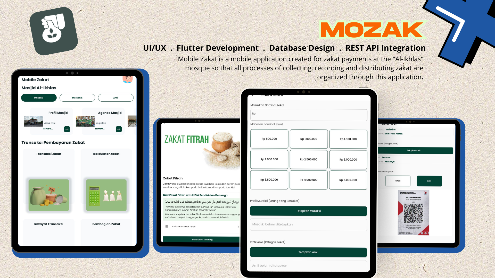
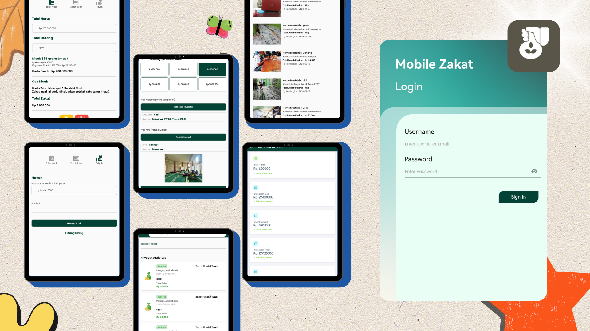

# Mobile Zakat (MOZAK) - Mobile App

Mobile Zakat is a mobile application created for zakat payments at the "Al-Ikhlas" mosque so that all processes of collecting, recording and distributing zakat are organized through this application.

## 🛠 Tech Stack
- Flutter
- PHP REST API
- MySQL
- Thermal Printer Support

## ✨ Fitur Utama
- Input Data Muzakki
- Input Data Mustahik
- Input Data Amil
- Transaksi Zakat
- Kalkulator Zakat
- Riwayat Transaksi Zakat
- Pembagian Zakat
- Riwayat Pembagian Zakat
- Riwayat Pembagian Zakat

## 📄 Handbook Product
[📘 Lihat Handbook PDF](https://drive.google.com/file/d/1LgIkjyLTDwakfCyqHHlCLriLi2Fra2TB/view?usp=drive_link)

## 📱 UI Preview

## 🚀 Video Demo APK
[⬇️ Video APK](https://drive.google.com/file/d/1NYik2BBRv0YaW71To2xP-Tz6X8-7SVjc/view?usp=sharing)

## 👤 My contribution
I worked on all parts of this application myself, including:
- UI design and creation using Flutter.
- Backend implementation using PHP Rest API and MySQL.
- Application testing and debugging.
